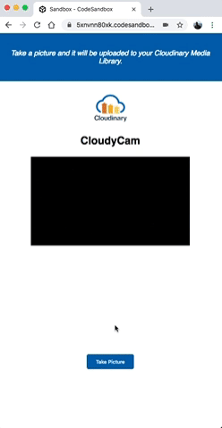

# How to Build an Offline PWA Camera App With React and Cloudinary

This tutorial steps you through the process of building an offline Progressive Web App \(PWA\) camera app with React and Cloudinary—one that takes pictures with your camera and then uploads it to your Cloudinary Media Library. A marvelous feature in the app is that when you're offline, the app stores your images in the browser’s local storage \(`localStorage`\). Once you're back online, the app automatically uploads all the saved pictures to your Media Library on Cloudinary.

