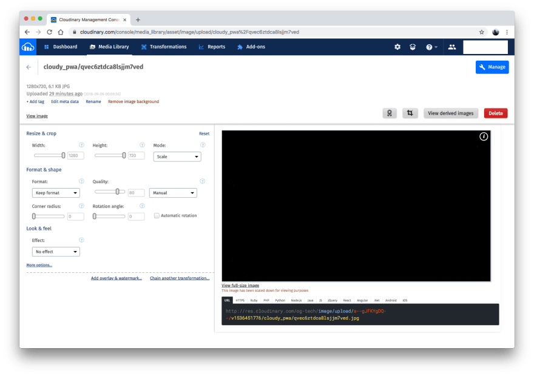

# Accessing Uploaded Images

To access your uploaded images, go to your [Cloudinary Media Library](https://cloudinary.com/console/media_library):

Feel free to use any of the images for your app as you desire. The [Cloudinary documentation](https://cloudinary.com/documentation) is a handy reference. 

